# Reflection
## Part 1
1. Compare the application logs before and after you exposed it as a Service. Try to open the app several times while the proxy into the Service is running. What do you see in the logs? Does the number of logs increase each time you open the app?
- Before Service:
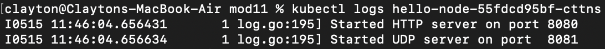
Before the application is exposed as a service, only the initialization logs are present.

- After Service:
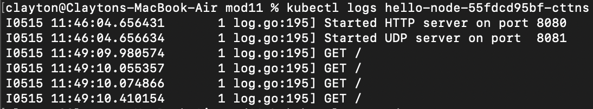
After the application is exposed as a service, the logs include several get requests. Each time the app is opened, a new get request is made `GET /` and logged.

2. What is the purpose of the `-n` option and why did the output not list the pods/services that you explicitly created?
The -n option in Kubernetes is shorthand for --namespace. We use this parameter to define which cluster we want to perform an operation in. Namespaces in Kubernetes are a way to divide cluster resources. Given a namespace, each resource must have a unique name, but can be reused across different namespaces. This is because a namespace is the scope of a cluster's resources. 
The output did not list the pods/services that were explicity created because the hello-node pod was created in a namespace outside the default namespace from Docker. `kubectl get pods` implies the resources from the default namespace. Hence the reason for using the `-n` parameter to specify a namespace.

## Part 2
1. What is the difference between Rolling Update and Recreate deployment strategy?
The difference between the Rolling Update and the Recreate Deployment strategies is underscored in the way the pods are replaced. In the Rolling Update strategy, the pods are replaced incrementally, reducing downtime since there are always active pods. Consequently, the risk of errors/bugs in new updates is less severe because the update can be rolled back to its previous state. In the Recreate Deployment strategy, every pod is replaced with the latest version, consequently shutting down the application until the pods are back online. However, this method carries an easier implementation because only one version of the application exists at a time.

2. Try deploying the Spring Petclinic REST using Recreate deployment strategy and document your attempt.
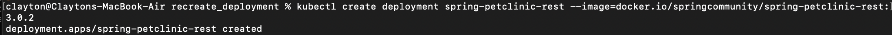
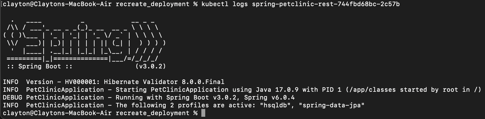
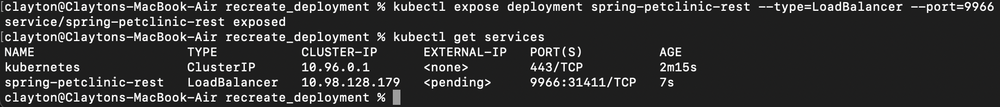
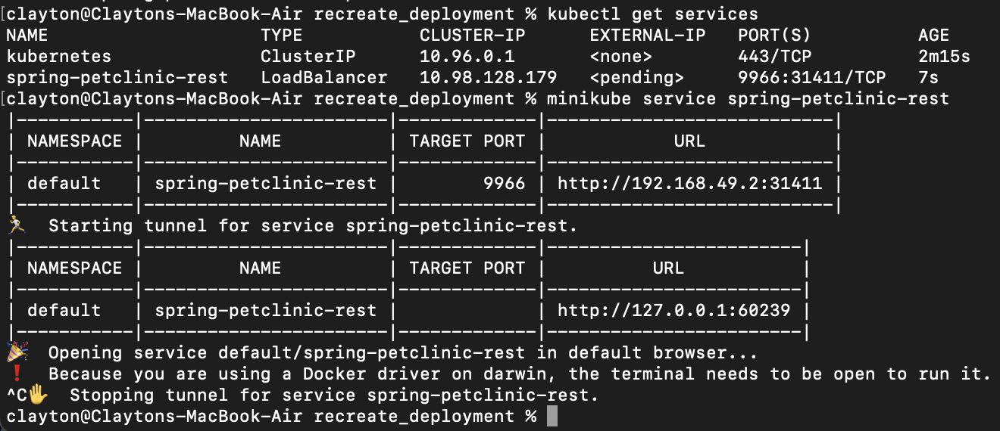
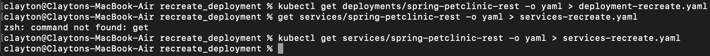
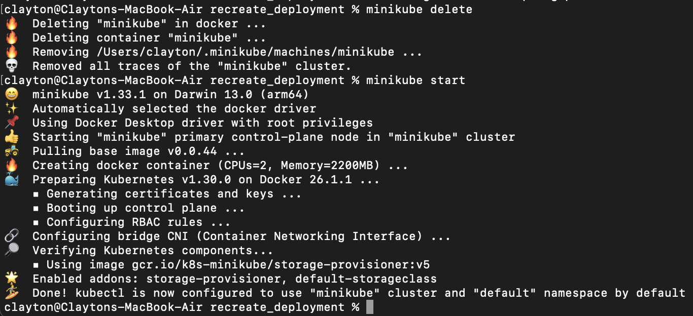
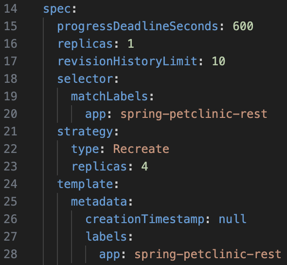
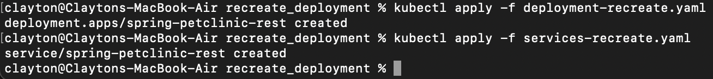
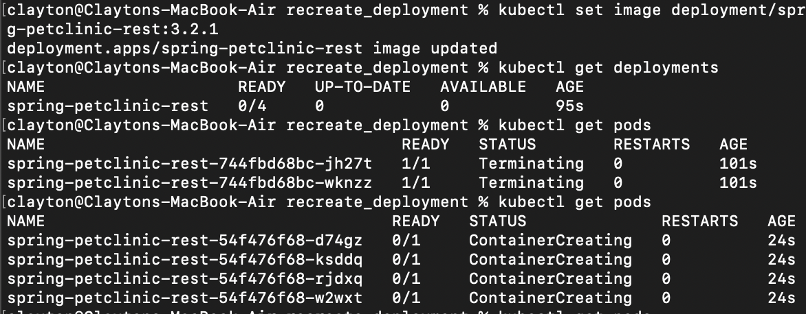
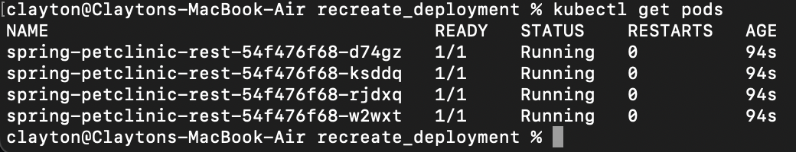

3. Prepare different manifest files for executing Recreate deployment strategy.
They can be found in the recreate_deployment folder.

4. What do you think are the benefits of using Kubernetes manifest files? Recall your experience in deploying the app manually and compare it to your experience when deploying the same app by applying the manifest files (i.e., invoking kubectl apply -f command) to the cluster.
The primary benefits to using Kubernetes manifest files is that they are more consistent as the files are clear and concise. Secondly, we have more control over the versions of the application as we can track changes to these files. Lastly, these files can be easily implemented into CI/CD pipelines.